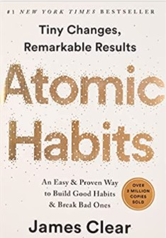

 &starf;&starf;&starf;&starf;&starf; 

# 🚀 The Book in 3 Sentences

1. Big goals are achieved one small habit at a time
2. Motivation is an unreliable resource, so try to embrace boredom and remove friction from good choices
3. Focus on creating a life-process not life-goals

# Who Should Read It?

This book is a great read for anyone wanting to improve their productivity and in general improve their life. It offers really useful and practical advice as to how to structure you life to nurture new good habits and break bad ones.

# ☘️ How the Book Changed Me

How my life / behaviour / thoughts / ideas have changed after reading the book.

- Habit stacking (stacking a new habit on top of an already existing one) is a great tool to start and stick to new habits
- The motto "Consistency beats perfection" which for me was one of the messages in the book, has been really helpful to keep in mind during busy days
- Making a habit satisfying by adding a small treat or some YouTube watching has worked great so far!

# ✍️ My Top 3 Quotes

- *The people with the best self-control are typically the ones who need to use it the least. It’s easier to practice self-restraint when you don’t have to use it very often.*
- *Desire is the difference between where you are now and where you want to be in the future. Even the tiniest action is tinged with the motivation to feel differently than you do in the moment.*
- *We are limited by where our habits lead us. This is why mastering the decisive moments throughout your day is so important. Each day is made up of many moments, but it is really a few habitual choices that determine the path you take. These little choices stack up, each one setting the trajectory for how you spend the next chunk of time.*

# 📒 Chapter Notes

**Chapter 1: The Surprising Power of Tiny Habits**

1% better every day will lead to extraordinary results if you stay the course, compounding works miracles also in life.

Progress is not linear, it consists of first building the foundation and then seeing the exponential results.

Long term success is achieved through systems and not goals as the latter offer only momentary satisfaction and a binary (success/failure) view of the world.

Changing habits requires establishing better systems and processes to nurture them.

**Chapter 2: How Your Habits Shape Your Identity (and Vice Versa)**

There are three habit forming steps: 

1. Outcomes (what you do) 
2. Processes (the systems you have in place in order to do the outcomes)
3. Identity change (your own identity that is aligned with your processes and outcomes)

The only way to reach identity change is to go through steps 1&2 but such a change is ultimately required for a habit to be fully mastered. 

Identity change and the accumulation of small habits can incrementally but surely turn you into the person you wish to become.

**Chapter 3: How to Build Better Habits in 4 Simple Steps**

Conscious attention is a limited resource our brain tries to preserve by creating habits (automated low effort activities).

The lifecycle of a habit: i) A cue (external or internal stimulus) leads to ii) craving (desire to alter the current situation) that triggers iii) a response (action) which brings iv) the reward.

Creating (or breaking) a habit comes down to:

- Make it (in)visible
- Make it (un)appealing
- Make it (complex)simple
- Make it (un)satisfactory

**Chapter 4: The Man Who Didn’t Look Right**

The first step of habit change is to notice and acknowledge them (out loud!).

**Chapter 5: The Best Way to Start a New Habit**

Scheduling the exact way, time and place in which you will perform a habit leads to higher chances of sticking with it.

Tie new habits to existing ones by starting them immediately after you compete an old one.

**Chapter 6: Motivation is Overrated; Environment Often Matters More**

Our surroundings matter more in the actions we take than our personality or our willpower.

Fill your surroundings with easy to spot "reminders" (cues) for the habit you wish to build.

Learn to link each space/room with one habit and don't mix (e.g. only work and not leisure happens at the desk).

**Chapter 7: The Secret to Self-Control**

The best way to become disciplined is to remove temptations from your life and to align the default option with the desired behavior.

**Chapter 8: How to Make a Habit Irresistible**

Human behavior is triggered through desires, which release dopamine both when a reward comes but also when it is expected.

Tie behaviors you aim to do (but are hard) with pleasurable behaviors you want to do in order to make them stick.

**Chapter 9: The Role of Family and Friends in Shaping Your Habits**

Humans have the need to belong and will adjust their behavior to match the one of the group.

Try to be close to people who already implement the habits you aspire to have.

Be mindful of herd behavior as it is very powerful and can lead you astray.

Pick your famous role-models carefully.

**Chapter 10: How to Find and Fix the Cause of Your Bad Habits**

Break down each and every part of undesirable habits to better grasp underlying motives. 

Craving is the need to alter our current situation into a desired one and is based on genetic needs (need for food, community, survival, etc.).

When trying to form hard habits, change the focus from the tiring and difficult parts to the positive outcomes you will experience if you do them (e.g. exercise will not exhaust you but it will make you faster and stronger).

**Chapter 11: Walk Slowly, But Never Backward**

Even small actions trump constant planning when it comes to getting better.

The currency of habit creation is repetitions and not time.

**Chapter 12: The Law of Least Effort**

Humans are optimization machines, we constantly perform the action that has the most benefit with the least cost.

Given that we are lazy, try to remove as much friction from a new desired habit.

Arrange your surroundings so as to make good habits easier and bad habits harder.

**Chapter 13: How to Stop Procrastinating by Using the Two-Minute Rule**

Habit implementation comes down to few and small decisive moments.

When forming a new habit, consistency trumps ambition so start really small but stick to it.

**Chapter 14: How to Make Good Habits Inevitable and Bad Habits Impossible**

Commitment devices (a friend that changes your Netflix password or removes all sweets from your fridge) can ensure that good habits become default and bad ones become hard.

Automate good habits (e.g. automatic pension contribution) and de-automate bad ones (e.g. delete all social media apps from your phone).

**Chapter 15: The Cardinal Rule of Behavior Change**

If you want a behavior to stick, make it pleasurable.

Our default attention span focuses on the now which helps bad habit formation (immediate reward-delayed cost).

Link good habits to immediate rewards.

**Chapter 16: How to Stick with Good Habits Every Day**

Adding visual tracking mechanisms (journal, calendar entries etc.) strengthens habits.

Don't break the habit chain! Stick to the schedule even if it means doing less than planned.

Never skip a habit two times in a row.

Be careful of what you measure because it will get optimised.

**Chapter 17: How an Accountability Partner Changes Everything**

Add immediate negative consequences to bad habits.

Create contractual agreements with people close to you that clearly define habit success and punishment in case of failure.

**Chapter 18: The Truth About Talent (When Genes Matter and When They Don’t)**

Genes matter, so pick a battleground where you have the genetic upper hand.

Align the habits that you aim for with your personality and not public consensus.

Identify activities that come naturally, feel easy and you are better than the average person as they might be the areas where you have the advantage.

Gene differences matter only after you put in the time and effort to reach peak performance levels.

**Chapter 19: The Goldilocks Rule—How to Stay Motivated in Life and Work**

Progressively increase habit difficulty in a way that (a) you stick to it (not too difficult) and (b) you get better at it (not too easy).

Embrace boredom and stick to your habits even when you don't feel like it.

**Chapter 20: The Downside of Creating Good Habits**

Mastery requires habits in combination with deliberate practice otherwise you end up stuck in the "good enough" territory.

Constantly measure and review habits in order to improve.

Detach your identity from specific roles and make it flexible (e.g. from "I am a data scientist" ← role specific transform your identity to "I like to solve problems and work with data").