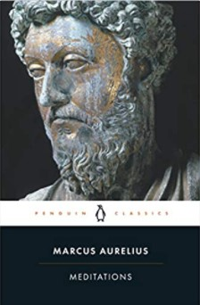

 &starf;&starf;&starf;&starf;&star; 

# 🚀 The Book in 3 Sentences

1. Philosophy is the only thing in life that is divine in an otherwise imperfect existence. 
2. Be friendly, kind and generous. Forgive others and constantly strive for virtue.
3. Be the master of your own mind, nothing external can touch it, it is only internal judgements that harm it.

## Who Should Read It?

People who want to learn more about stoic philosophy should definitely read this book, it is a great example of how a man puts the stoic lessons in use in his everyday life.

Also a great opportunity to get into the mind of one of the greatest Roman emperors, understand the way he perceived himself and others. It is fascinating that Marcus Aurelius was so focused on philosophy and self-improvement even in such a difficult time for the empire.

# ☘️ How the Book Changed Me

How my life / behaviour / thoughts / ideas have changed as a result of reading the book.

- Enforced the benefits of stoicism. Having a great emperor give his stamp of approval to a philosophy gives it extra credibility
- It doesn't matter when your life will end or how long it will last, the only thing that matters is how you live each current moment of it. Make the most out out of it.

# ✍️ My Top 3 Quotes

- Remove the judgement.
- The best revenge is not to be like your enemy.
- Let any external thing that so wishes happen to those parts of me which can be affected by its happening – and they, if they wish, can complain. I myself am not yet harmed, unless I judge this occurrence something bad: and I can refuse to do so.