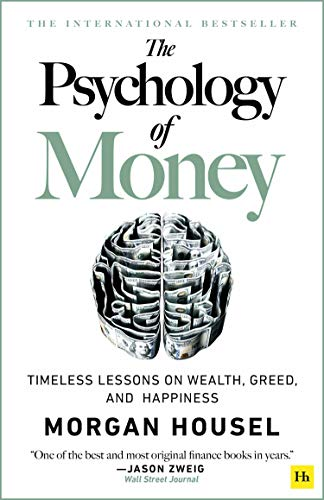

 &starf;&starf;&starf;&starf;&starf; 

🚀 The Book in 3 Sentences 

1. Money and investing are emotional topics and therefore optimal allocation is really person-specific
2. Every investor's best friends are frugality, self-control and a long time horizon for compounding to work its miracles
3. Dictating how you spend your time is the greatest thing that money can buy

Who Should Read It? 

This is an amazing book that can help just about anybody. The lessons are presented in a very easy to follow manner with clear narratives. Even if not all advice in the book is applicable to you, I am willing to bet you will get value out of reading it.

☘️ How the Book Changed Me 

How my life / behaviour / thoughts / ideas have changed as a result of reading the book.

- Accepting that financial planning is not 100% an optimisation game but has to account for the emotional component helped me improve my decision making
- Margin of safety is always in the back of my mind in any financial decision

✍️ My Top 3 Quotes 

- More than I want big returns, I want to be financially unbreakable. And if I’m unbreakable I actually think I’ll get the biggest returns, because I’ll be able to stick around long enough for compounding to work wonders.
- The highest form of wealth is the ability to wake up every morning and say, “I can do whatever I want today.”
- You might think you want an expensive car, a fancy watch, and a huge house. But I’m telling you, you don’t. What you want is respect and admiration from other people, and you think having expensive stuff will bring it. It almost never does—especially from the people you want to respect and admire you.

📒 Summary - 1 sentence per chapter 

**Chapter 1: No One’s Crazy**

*Show me your personal experiences and I will be able to comprehend any investment choice you make*

**Chapter 2: Luck & Risk**

*Assessing probabilities in one-time events is impossible, therefore it is important to focus on sound general principles and not specific results*

**Chapter 3: Never Enough**

*Constantly wanting more is a disease caused by social comparison and subsequent envy*

**Chapter 4: Confounding Compounding**

*The magic ingredient to produce amazing results through compounding is time and not seeking the highest return*

**Chapter 5: Getting Wealthy vs. Staying Wealthy**

*Being fearful and avoiding ruin at all costs are the ways to maintain your wealth*

**Chapter 6: Tails, You Win**

*Failures are part of the investing game, what is important is that you keep playing*

**Chapter 7: Freedom**

*Money offers the freedom to dictate how you spend another limited resource: your time*

**Chapter 8: Man in the Car Paradox**

*Flaunting riches will not get you the respect and admiration you actually crave for*

**Chapter 9: Wealth Is What You Don’t See**

*Being wealthy does not leave traces for others to follow, in contrast to the misleading breadcrumbs that are created by spending money*

**Chapter 10: Save Money**

*The most important rate in becoming wealthy is your savings rate, as it only depends on you and your ability to not get influenced by what others think*

**Chapter 11: Reasonable > Rational**

*Personal finance is an emotional topic handled by emotional beings, so try to aim for peace of mind rather than maximising returns in financial decisions*

**Chapter 12: Surprise!**

*Groundbreaking world and economic changes cannot be predicted based on history or to phrase it in another way, past performance does not guarantee future returns*

**Chapter 13: Room for Error**

*Plan for a possible failure of your plans in order to allow yourself to stay in the game even in adverse conditions*

**Chapter 14: You’ll Change**

*Accept that you will change and try to minimise your future self's regrets by avoiding extremely radical investment decisions*

**Chapter 15: Nothing’s Free**

*Market volatility is the price you pay for investment returns, embrace it or bad things happen*

**Chapter 16: You & Me**

*You and your investment horizon determine the correctness of your financial choices, not what others are doing*

**Chapter 17: The Seduction of Pessimism**

*Disasters happen overnight and lead to compelling pessimism spirals, while miracles take a long time before they get noticed*

**Chapter 18: When You’ll Believe Anything**

*We understand life through stories and not data, try not to be fooled by appealing and misleading ones*

**Chapter 19: All Together Now**

*Book summary chapter*

**Chapter 20: Confessions**

*How the author invests his money*
