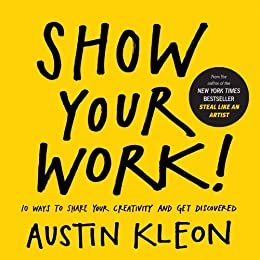

    

    
  &starf;&starf;&starf;&starf;&star; 

---

### Worth remembering

Anybody can share their work, it is not strictly for geniuses  

Practice makes perfect, so share something every day  

Focus on sharing a story that someone can relate to  

Support and promote work that has inspired you  

Work is never over, always improve, refine and throw away 

---

### A little longer

Share your work by Austin Kleon is a great book that felt very appropriate for someone like me. The main point of the book is to convey the importance of sharing your work with the outside world 
and dispell the myth of the lone genius that works ceaselessly in a basement until the masterpiece is ready. 

After that it is all about the logistics of how and what to share. Establishing a process for creating work, guiding people through 
said process by creating stories they can relate to, accepting and embracing criticism are all covered. 
I found really interesting the parts about "selling out" (making money out of your work) and accepting that you will need to refine your process over time which can involve scraping or redoing parts already done. Throughout all this though, it 
is crucial that you keep in the game and don't quit.

