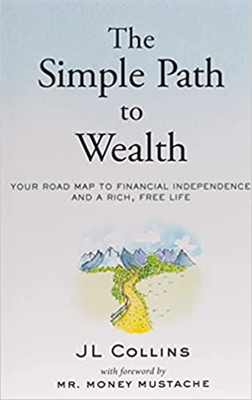

 &starf;&starf;&starf;&starf;&starf; 

# 🗒️ My take

J.L.Collins has produced a great book, which, true to its name, is a very simple path to wealth. The strategies and suggestions are straightforward and backed by reasonable arguments. 

The concept of having enough money on the side (F-you money) that grants you the flexibility to be selective about which projects/work to pursue is a great concept that I try to adhere to. Also all the warnings that investing success does not come down to intelligence or complicated products, but to low costs and reigning in our psychology. 

The only "drawback" (for me at least 🙂) is that this book is mainly focused on US investors and therefore some of the chapters (about IRA, ROTH etc.) are not relevant for other nations. 

# 🚀 The Book in 3 Sentences

1. Keep your costs lower than your income, avoid debt, invest surpluses and you will become wealthy
2. Index funds are the best vehicle to accumulate and maintain wealth as they are very well diversified and have low costs
3. Adjust your psychology to your investments and not the other way round. Market turmoil is normal but it can be detrimental if you panic and sell

# ✍️ My Top 3 Quotes

- *There are many things money can buy, but the most valuable of all is freedom. Freedom to do what you want and to work for whom you respect.*
- *Those who live paycheck to paycheck are slaves. Those who carry debt are slaves with even stouter shackles. Don’t think for a moment that their masters aren’t aware of it.*
- *The harsh truth is, I can’t pick winning individual stocks and you can’t either. Nor can the vast majority who claim they can. It is extraordinarily difficult, expensive and a fool’s errand. Having the humility to accept this will do wonders for your ability to accumulate wealth.*

# 📒 Summary notes

*About debt*

Debt is not something that should be considered an acceptable part of your life as it reduces both your spending power (money is lost in interest payments) and your health (through repayment stress) and your freedom (you have to maintain a steady income source to repay it, so try to repay it as efficiently and quickly as possible.

*How to think about money*

1. Stop thinking about what money can buy and start thinking about how money can grow if invested
2. The opportunity cost of spending money is very high if you take into consideration that if invested it would have returned significant amounts of compound interest over the same period
3. Owning stocks means owning a part of a business. So as long as the business is good, price fluctuations should not worry you

*How to invest in bear or bull markets*

Investing is tied to two emotions: fear and greed. Unfortunately, neither of them is particularly helpful for investing. When in a bear market, we always ask "Should I wait for the plunge to be over and then start investing?" while in a bull market "Should I invest now that everything is so overpriced and the market is about to crash?". The answer is always that nobody can predict what the market will do, therefore invest now and stay the course.

*Market characteristics*

- Market crashes are normal and part of business
- Market always recovers
- Market always goes up over the long term
- Stay the course and keep investing

*Why do markets always go up*

The downside of a stock is 100% (loses all its value). The upside of a stock is infinite. 
Companies are comprised of highly ambitious people working their asses off to achieve the best results possible.

*Why do people lose money at the market*

- We think we can time the market and end up buying high and selling low
- We think we can pick winners
- We think we can find the managers that can pick the winners

*How to think of the stock market:*   

Think of it as beer! 🍺 🍺
The foam part is the traded piece of paper that moves millions of times throughout the day and has lots of price fluctuations.
The beer part is the actual company behind this piece of paper.
Be in it for the beer!

*Considerations for investments*
1. Wealth accumulation or wealth preservation stage?
2. What level of risk do you find acceptable?
3. Long or short term investment horizon?

*The three tools for building wealth*

VTSAX → Build wealth 
VBTLX → Smoothen out the ride
Cash → Emergencies

*On index funds*

Index funds are not for the average lazy person. They are for everybody as it is extremely hard to predict the market and the costs that one has to incur (time and money for buying and selling stocks) make this even harder

*How to invest based on whether you are accumulating or maintaining wealth*

- Wealth accumulation portfolio → Own VTSAX for life (100% stocks or 80-90 and 20-10 bonds with rebalancing). Stocks are by far the best performing asset in the world.
- Wealth preservation portfolio → VTSAX 75% VBTLX 20% Cash 5%  
How to invest in those? Focus on tax deferred accounts (offered via your company) or making use employer matching when it comes to pension contributions

*What can hurt your portfolio*

Temperament → Can you handle the fluctuations?
Flexibility → Can you change your spending depending on the economic situations? 

*Does age matter in investing*

Even though age is just a number and nowadays people lead active and longer lives, it does restrict the effect that compounding can have on your investments and it makes you more susceptible to big market swings. So as you grow older, you might want to switch a bigger allocation of your portfolio towards bonds.

*What to do when Vanguard is not an option*

VTSAX and VBTLX are all based on indices. Simply try to find a respectable company which has a low-cost diversified fund with a very similar investment policy. (For Europeans a very useful discussion about how to still invest in Vanguard can be found here: [https://jlcollinsnh.com/2020/04/22/investing-with-vanguard-for-europeans-2020-update/](https://jlcollinsnh.com/2020/04/22/investing-with-vanguard-for-europeans-2020-update/))

Why should you not get a financial advisor
Conflict of interests → The advisor has to make profit out of selling his service therefore low-cost simple products are not particularly enticing for him. On other hand you as investor want to keep your costs as low as possible and accumulate wealth.
Therefore, everybody has two choices: 
1. Spend time to pick your advisor 
2. Spend time to pick your investments → The choice is clear

*Why is it hard to pick stocks*

The outlook/financial data of a company inherently depends on the predictions that are made inside the company about their clients/profits. As these predictions pass through layers and layers of low-middle-high management they change in order to address the publicity needs of the company (too low numbers and Wall Street will get nervous, too high numbers and the company might miss the estimates by a lot) as well as the personal perspectives of all the managers that had to be consulted on those numbers. 

*The argument against dollar cost averaging*

Dollar cost averaging simply means when you have a lump sum of money to invest, you split it in say 12 increments and invest the 1/12th of your money every month instead of putting it all in at once. 
The argument against such an approach would be that by not investing everything at once, you are essentially betting on the market to go down which happens roughly ~23% of the time. 
J. L. Collins recommends just biting the bullet and investing everything at once. 

*Everybody (including YOU) can be conned* 

We are always thinking that getting conned is something that happens to other people (the not so smart as we are people). This puts you in prime position to be conned. Some things to always keep in mind:
1. You can be conned 
2. You will be conned in an area where you think (or are) an expert as you will have the most confidence in your decisions and you will not factcheck them sufficiently
3. Con-men appear trustworthy, offer a 99% truthful product and discovering their lies requires getting into the details 
4. If it looks to be good to be true, IT IS

*Safe withdrawal rate, i.e. how much of your portfolio can you spend in retirement*

4% is the magic number. Based on a paper published in 1994 (here: [https://www.researchgate.net/publication/228707593_Sustainable_withdrawal_rates_from_your_retirement_portfolio](https://www.researchgate.net/publication/228707593_Sustainable_withdrawal_rates_from_your_retirement_portfolio)) withdrawing 4% of your portfolio annually for a period of 30 years is sustainable (and your portfolio might even grow larger than the original starting point due to stock market appreciation)

⚠️ You might need to adjust your spending if let's say you started withdrawing right at the peak of a financial crisis

⚠️ Do not withdraw 4% automatically! Pay attention to how much you actually need and the state of the economy (inflation!!)

J. L. Collins recommends picking a 75/25 stock bond allocation and sticking to 3% for reliable results