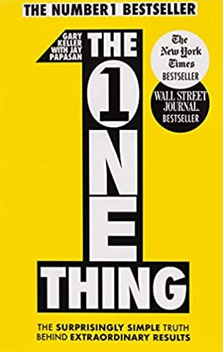

 &starf;&starf;&starf;&starf;&star; 

# 🚀 The Book in 3 Sentences

- Extraordinary results come from unrelenting focus on ONE thing
- Live your life purposefully, question and improve constantly  
- 20% of the effort produces 80% of the results, everything does not matter equally  

# Who Should Read It?

Predominantly a productivity book, I would recommend it to people aiming to get more primarily out of their work and secondarily out of their life. It is a short and generalizable book (the advice is not targeted at specific professions or lifestyles) which makes it suitable for a broader audience. 

# ☘️ How the Book Changed Me

<aside>
💡 How my life / behaviour / thoughts / ideas have changed as a result of reading the book.

</aside>

- I have been trying to implement the focus on ONE thing for quite some time (unfortunately with limited success I might add...)
- Time blocking is a habit I have fully embraced, and I use my morning hours for the most challenging task of the day
- I plan on allocating more time into planning yearly/monthly/weekly goals

# ✍️ My Top 3 Quotes

*Don't let small thinking cut your life down to size. Think big, aim high, act bold. And see just how big you can blow up your life.*  

*I learned that success comes down to this: being appropriate in the moments of your life. If you can honestly say "This is where I'm meant to be right now, doing exactly what I'm doing," then all the amazing possibilities for your life become possible.*  

*Who we are and where we want to go determine what we do and what we accomplish. A life lived on purpose is the most powerful of all — and the happiest.*

# 📒 Summary in My Own Words

**Chapter 1: The ONE Thing**

The trick to big success is to go small and focus on a single thing.

**Chapter 2: The Domino Effect**

Consistent success and effort accumulate over time to extraordinary results.

**Chapter 3: Success Leaves Clues**

Success and the ONE thing often come together (think of Apple and the iPhone, Google and search, Intel and microprocessors).

**Chapter 4: Everything Matters Equally** 

20% of the effort brings 80% of the results. Ticking off to-do lists with many small items gives us a sense of accomplishment without moving us forward.

**Chapter 5: Multitasking**

Multitasking is a time-costly illusion, that can turn into a bad habit if left unattended. Focus on ONE thing and accept that dealing with distractions is part of the process.

**Chapter 6: A Disciplined Life**

Disciplining your way to success is not a sustainable course of action. Apply discipline only when it comes to building life habits as they are the most effective way of achieving your goals.

**Chapter 7: Willpower Is Always on Call**

Willpower is a limited resource and should be treated as such. Timing daily activities based on their importance and refueling your willpower (by snacking 🥗 or taking a break) is the way to go.

**Chapter 8: A Balanced Life**

Extraordinary results require significant time investments, which goes contrary to the balanced life hypothesis. Therefore the focus should be on counterbalancing life and work based on:
1. Time split between them. If a period requires spending many hours at work, aim to focus more on health, family and friends once the task is achieved.
2. Prioritization. For both work and life there is ONE thing that is of the highest importance. Counterbalance neglecting other stuff by progressing on the ONE thing.

**Chapter 9: Big Is Bad**

Our limits are unknowns that we can only find out by aiming big. Aim high, embrace failure and act boldly.

**Chapter 10: The Focusing Question**

When deciding on what to work on at every moment, pick the ONE thing you can do that will make achieving your ONE big goal easier.

**Chapter 11: The Success Habit**

Make a habit of asking "What is the ONE thing I can do right now that will make achieving my ONE big goal easier"(the focusing question) in all aspects of your life e.g. mental health, physical health, work, relationship with your friends. Repetition will turn it into a habit that will drastically improve your results.

**Chapter 12: The Path to Great Answers**

Set concrete and big goals. To achieve them you need two things:
1. Benchmarking → Understand (by reading, following, researching etc.) how top performers have tackled similar goals
2. Trending → Try to forecast what is the next step. Stand on the shoulders of giants but push yourself to go one step further

**Chapter 13: Live with Purpose**

Purpose is the fundamental building block of life and happiness. Finding it can be difficult, but start small by striving for something that you consider worth achieving. If turns out to be a mistake, you can always change direction.

**Chapter 14: Live by Priority**

We severely discount future rewards for pleasures in the now. In order to mitigate this limitation, one has to break down the ONE thing into smaller time intervals: "What is the ONE thing you can do today that will help you achieve the ONE thing of the week...."

**Chapter 15: Live for Productivity**

Time blocking (creating uninterrupted chunks of time for a specific action) is essential for productivity, so create and guard them. The most important blocks:
1. Time block your rest → Plan your vacation
2. Time block your ONE thing → Set a time span of 4 hours to work on your priority
3. Time block planning → One hour a week to review your annual and monthly goals

**Chapter 16: The Three Commitments**

1. Constantly strive for improvement, there is always something to learn
2. Find the best way to tackle challenges, don't tackle them the best way you can
3. Be accountable of your actions and their results (either to yourself or an accountability partner)

**Chapter 17: The Four Thieves**

1. Learn to say "NO". Focusing on the ONE thing requires rejecting a myriad others
2. Accept the imbalances that will be caused by your unrelenting focus and learn to cope with them
3. Treat your mind and your body well to be productive
4. Ensure that your environment, both surroundings and people, support your ONE thing**

**Chapter 18: The Journey**

Aim to live a life with no regrets. We can all achieve great things but most of the time we let them go to waste. Start by putting yourself together, then focus on the ONE thing of the day and step by step greatness can be achieved.